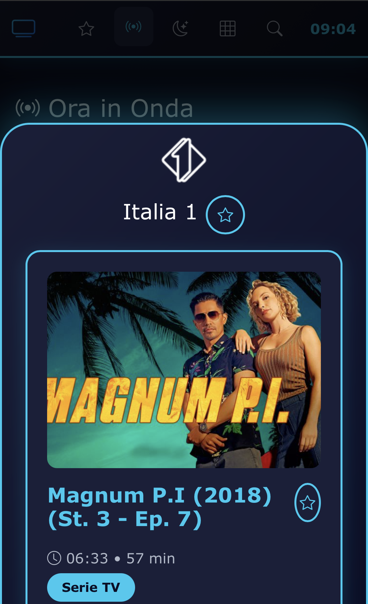

# 📺 GuidaTV

> Una moderna applicazione web Single Page per la guida TV italiana con streaming integrato

[](https://opensource.org/licenses/MIT)
[](https://developer.mozilla.org/en-US/docs/Web/HTML)
[](https://getbootstrap.com/)
[](https://vuejs.org/)

## ✨ Caratteristiche

- 🎨 **Design moderno** con dark theme e accenti blu/cyan
- 📱 **Mobile-first** e completamente responsive
- 🔴 **Streaming live** integrato con supporto HLS (M3U8)
- 🕐 **Ora in Onda** - Visualizza i programmi attualmente in onda
- 🌙 **Stasera** - Programmazione serale (20:00-23:00)
- 📋 **Lista Canali** - Griglia completa con tutti i canali disponibili
- 🔍 **Ricerca avanzata** - Cerca tra canali e programmi
- ⏱️ **Progress bar** - Indicatore di avanzamento programma in tempo reale
- 🌍 **Conversione timezone** - Automatica da UTC a fuso orario italiano
- 🎬 **Video player** - Player integrato con HLS.js

## 🚀 Demo

[**Visualizza Demo Live**](https://guidatv.vercel.app/) _(inserisci il link alla tua demo)_

## 📸 Screenshot

### Desktop


### Mobile


## 🛠️ Tecnologie Utilizzate

- **HTML5** - Struttura semantica
- **CSS3** - Styling moderno con animazioni
- **JavaScript (ES6+)** - Logica applicativa
- **Vue.js** - Framework reattivo _(opzionale)_
- **Bootstrap 5.3** - Framework CSS responsive
- **Bootstrap Icons** - Set di icone
- **HLS.js** - Supporto streaming HLS/M3U8

## 📦 Installazione

### Prerequisiti

Nessun prerequisito particolare! L'applicazione è completamente standalone e funziona aprendo semplicemente il file HTML.

### Setup Rapido

1. **Clona il repository**
   ```bash
   git clone https://github.com/tuousername/guidatv.git
   cd guidatv
   ```

2. **Prepara le immagini** (opzionale ma consigliato)
   
   Crea la cartella `/img/` e aggiungi:
   - `apple-touch-icon.png` (180x180px)
   - `og-image.jpg` (1200x630px)
   - `twitter-image.jpg` (1200x600px)
   
   E in radice:
   - `favicon.ico`

3. **Apri l'applicazione**
   ```bash
   # Con un server locale (consigliato)
   python -m http.server 8000
   # oppure
   npx serve
   
   # Oppure apri direttamente index.html nel browser
   ```

4. **Accedi all'app**
   
   Apri il browser e vai su `http://localhost:8000`

## 📁 Struttura del Progetto

```
guidatv/
│
├── index.html              # File principale dell'applicazione
├── favicon.ico            # Favicon del sito
├── README.md              # Questo file
│
├── img/                   # Cartella immagini (da creare)
│   ├── apple-touch-icon.png
│   ├── og-image.jpg
│   └── twitter-image.jpg
│
└── screenshots/           # Screenshot per README (opzionale)
    ├── desktop.png
    └── mobile.png
```

## 🎯 Utilizzo

### Navigazione

- **Ora in Onda**: Clicca sulla sezione per vedere i programmi attualmente in onda
- **Stasera**: Visualizza la programmazione serale (20:00-23:00)
- **Lista Canali**: Griglia completa di tutti i canali disponibili
- **Cerca**: Utilizza la ricerca per trovare canali o programmi specifici

### Streaming

1. Naviga verso un canale nella sezione "Ora in Onda" o "Lista Canali"
2. Clicca sul pulsante **Play** (▶️)
3. Il player video si aprirà automaticamente con lo streaming

### Visualizzazione Programmi

- **Click su un canale**: Apre i dettagli del programma corrente o la programmazione completa
- **Progress bar**: Mostra l'avanzamento del programma in tempo reale
- **Informazioni**: Ora di inizio, durata, genere e descrizione

## 🔧 Configurazione

### Sorgente Dati

L'applicazione recupera i dati EPG (Electronic Program Guide) da:

```
https://tvit.leicaflorianrobert.dev/epg/list.json
```

Per utilizzare una sorgente dati personalizzata, modifica l'URL nel metodo `loadData()`:

```javascript
async loadData() {
    const response = await fetch('TUO_URL_JSON_QUI');
    // ...
}
```

### Formato JSON Richiesto

```json
{
  "channels": [
    {
      "name": "Nome Canale",
      "logo": "url_logo",
      "playlist": "url_streaming_m3u8",
      "programs": [
        {
          "title": "Titolo Programma",
          "start": "2024-01-01T10:00:00Z",
          "stop": "2024-01-01T11:00:00Z",
          "category": "Film",
          "description": "Descrizione programma",
          "image": "url_immagine"
        }
      ]
    }
  ]
}
```

### Personalizzazione Colori

Modifica le variabili CSS in `:root`:

```css
:root {
    --primary-color: #0dcaf0;      /* Colore primario */
    --secondary-color: #0d6efd;    /* Colore secondario */
    --dark-bg: #0a0e27;            /* Sfondo scuro */
    --card-bg: #1a1f3a;            /* Sfondo card */
    --hover-bg: #252b4a;           /* Sfondo hover */
}
```

## 🌐 Browser Supportati

- ✅ Chrome/Edge (88+)
- ✅ Firefox (78+)
- ✅ Safari (14+)
- ✅ Opera (74+)
- ✅ Mobile browsers (iOS Safari, Chrome Mobile)

## 📝 SEO e Meta Tags

L'applicazione include tutti i meta tag necessari per:

- ✅ SEO ottimizzato
- ✅ Open Graph (Facebook)
- ✅ Twitter Cards
- ✅ Favicon e icone app
- ✅ Theme color per browser mobile

## 🤝 Contribuire

I contributi sono sempre benvenuti! Se vuoi contribuire:

1. Fai un Fork del progetto
2. Crea un branch per la tua feature (`git checkout -b feature/AmazingFeature`)
3. Commit delle modifiche (`git commit -m 'Add some AmazingFeature'`)
4. Push al branch (`git push origin feature/AmazingFeature`)
5. Apri una Pull Request

## 🐛 Segnalazione Bug

Hai trovato un bug? [Apri una issue](https://github.com/tuousername/guidatv/issues/new) con:

- Descrizione dettagliata del problema
- Passaggi per riprodurre il bug
- Screenshot (se applicabile)
- Browser e versione utilizzata

## 📄 Licenza

Questo progetto è rilasciato sotto licenza MIT - vedi il file [LICENSE](LICENSE) per i dettagli.

## 👨‍💻 Autore

**emax83dev**

- GitHub: [@emax83dev](https://github.com/emax83dev)

## 🙏 Ringraziamenti

- [Bootstrap](https://getbootstrap.com/) - Framework CSS
- [Bootstrap Icons](https://icons.getbootstrap.com/) - Set di icone
- [HLS.js](https://github.com/video-dev/hls.js/) - Supporto streaming HLS
- [EPG Data Source](https://tvit.leicaflorianrobert.dev/) - Sorgente dati programmi TV
- [THANKS TO REAL DEV MASTER:](https://github.com/leicaflorian/tvit) - GitHub LEICAFLORIAN

## 📊 Roadmap

- [ ] Aggiunta notifiche per programmi preferiti
- [ ] Sistema di preferiti/bookmark
- [ ] Filtri per genere/categoria
- [ ] Visualizzazione settimanale
- [ ] Integrazione con backend personalizzato
- [ ] PWA (Progressive Web App)
- [ ] Dark/Light theme toggle
- [ ] Multilingua

---

<div align="center">
  
**Se il progetto ti è piaciuto, lascia una ⭐ su GitHub!**

Made with ❤️ by emax83dev


</div>
